# OHO Task Management System - Data Flow Diagram

## ภาพรวมระบบ
OHO Task Management System เป็นแอปพลิเคชั่น Flutter สำหรับจัดการงานและโปรเจค ที่ใช้สถาปัตยกรรม Clean Architecture พร้อม Riverpod เป็น State Management

## Data Flow Layers

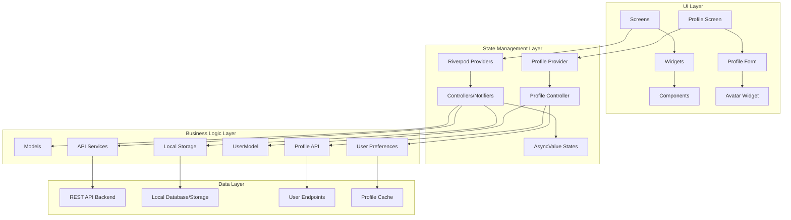

## หลัก Data Flow ของระบบ

### 1. Authentication Flow
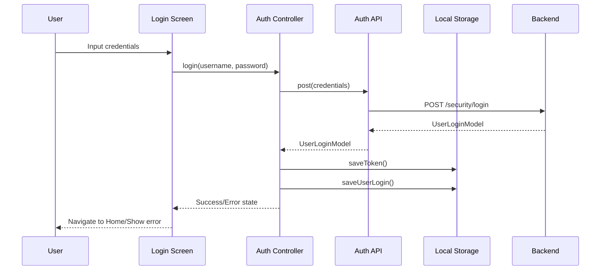

### 2. Workspace Management Flow
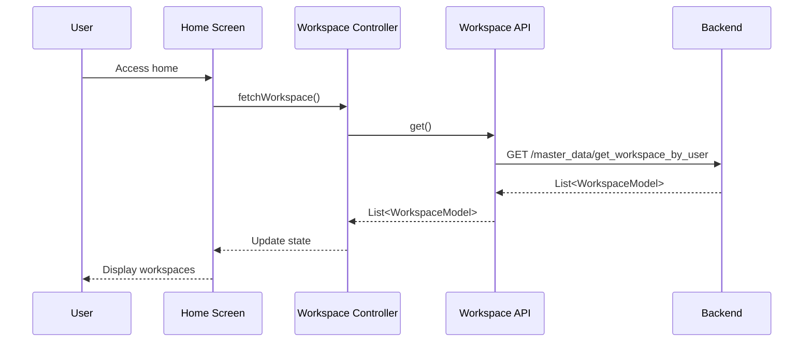

### 3. Project Management Flow
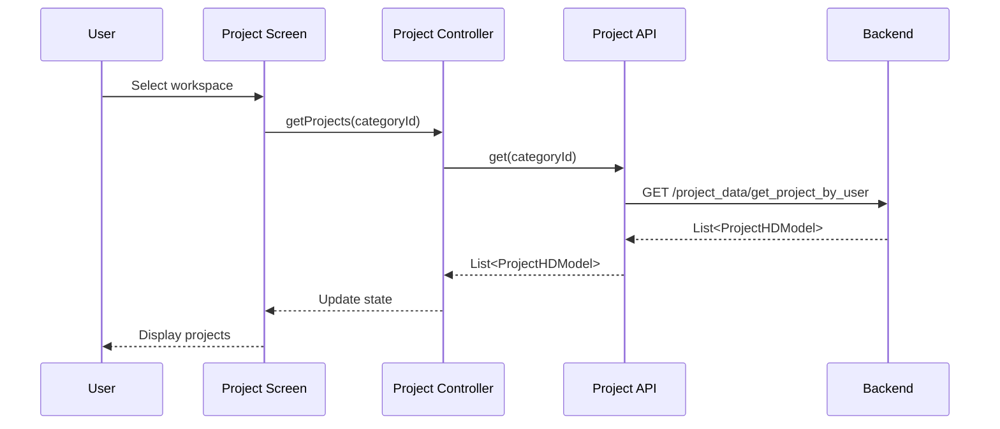

### 4. Task Management Flow
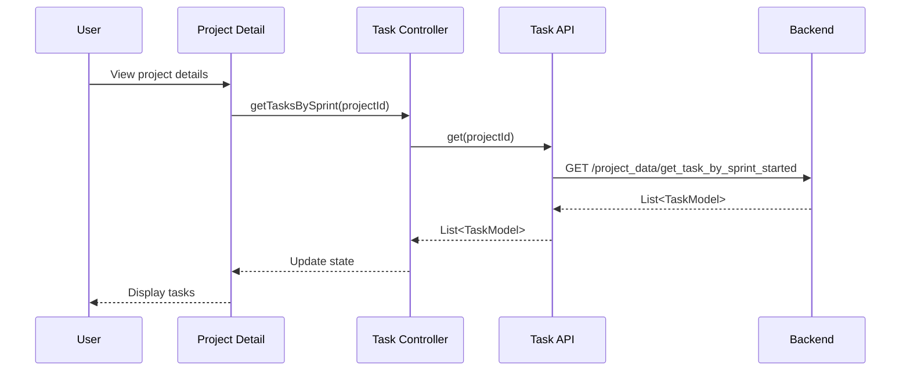

### 5. Profile Management Flow
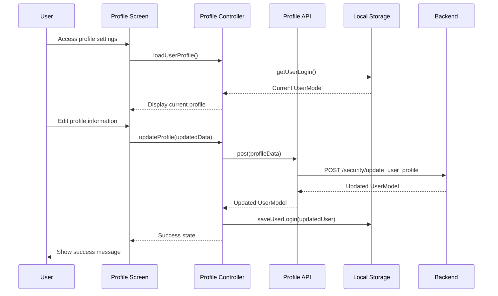

## Core Data Models

### 1. User & Authentication
- **UserLoginModel**: ข้อมูล login และ access token
- **UserModel**: ข้อมูลผู้ใช้
- **UserRoleModel**: บทบาทของผู้ใช้

### 2. Workspace & Projects
- **WorkspaceModel**: พื้นที่ทำงาน
- **CategoryModel**: หมวดหมู่โปรเจค
- **ProjectHDModel**: ข้อมูลโปรเจค

### 3. Task Management
- **SprintModel**: Sprint สำหรับการจัดการงาน
- **TaskModel**: งาน/Task
- **TaskStatusModel**: สถานะของงาน
- **PriorityModel**: ลำดับความสำคัญ
- **TypeOfWorkModel**: ประเภทของงาน

### 4. Activity & Comments
- **CommentModel**: ความคิดเห็น
- **ActivityTypeModel**: ประเภทกิจกรรม

## API Endpoints Structure

### Master Data APIs
- `/master_data/get_workspace_by_user` - ดึง workspace ของ user
- `/master_data/insert_or_update_workspace` - เพิ่ม/แก้ไข workspace
- `/master_data/delete_workspace_role` - ลบ user จาก workspace

### Project Data APIs
- `/project_data/get_project_by_user` - ดึงโปรเจคของ user
- `/project_data/insert_or_update_project_hd` - เพิ่ม/แก้ไขโปรเจค
- `/project_data/get_sprint_by_project` - ดึง sprint ของโปรเจค
- `/project_data/get_task_by_sprint_started` - ดึง task ใน sprint
- `/project_data/dashboard_*` - APIs สำหรับ dashboard data

### Security APIs
- `/security/login` - เข้าสู่ระบบ
- `/security/update_user_profile` - แก้ไขข้อมูลส่วนตัว
- `/security/change_password` - เปลี่ยนรหัสผ่าน
- `/security/upload_avatar` - อัพโหลดรูปโปรไฟล์

## State Management Pattern

### Riverpod Providers Architecture
```dart
// API Provider
final apiProvider = Provider<APIClass>((ref) => APIClass(ref: ref));

// Controller Provider
final controllerProvider = StateNotifierProvider<Controller, AsyncValue<Data>>(
  (ref) => Controller(ref)
);

// UI Consumer
Consumer(
  builder: (context, ref, child) {
    final state = ref.watch(controllerProvider);
    return state.when(
      data: (data) => DataWidget(data),
      loading: () => LoadingWidget(),
      error: (error, stack) => ErrorWidget(error),
    );
  }
)
```

## Local Storage Services

### LocalStorageService
- **saveToken()**: บันทึก access token
- **getToken()**: ดึง access token
- **saveUserLogin()**: บันทึกข้อมูล user
- **getUserLogin()**: ดึงข้อมูล user

## Navigation Structure

### App Router (GoRouter)
```
/login - หน้าเข้าสู่ระบบ
/home - หน้าหลัก (Workspace selection)
/project - หน้าโปรเจค
  /detail - รายละเอียดโปรเจค
/setting - การตั้งค่า
  /profile - โปรไฟล์
```

## Error Handling Flow

### Dio Interceptor Pattern
1. **Request Interceptor**: เพิ่ม Authorization header
2. **Response Interceptor**: จัดการ response
3. **Error Interceptor**: จัดการ error และ redirect กรณี 401

### State Error Handling
```dart
state.when(
  data: (data) => SuccessWidget(),
  loading: () => LoadingWidget(),
  error: (error, stack) => ErrorWidget(error)
);
```

## Performance Optimizations

### 1. Provider Caching
- ใช้ `Provider` สำหรับ services ที่ไม่เปลี่ยนแปลง
- ใช้ `StateNotifierProvider` สำหรับ state ที่เปลี่ยนแปลง

### 2. Lazy Loading
- โหลดข้อมูลเมื่อจำเป็นเท่านั้น
- ใช้ `FutureProvider.family` สำหรับ parameterized data

### 3. State Invalidation
- ใช้ `ref.invalidate()` เพื่อรีเฟรชข้อมูล
- ใช้ `ref.refresh()` สำหรับ force reload

## Security Considerations

### 1. Token Management
- เก็บ token ใน secure storage
- Auto-refresh token mechanism
- Logout เมื่อ token หมดอายุ

### 2. API Security
- Bearer token authentication
- Error handling สำหรับ unauthorized access
- Secure HTTP communication

## CRUD Operations Flow

### Create Operations

#### 1. Create Workspace
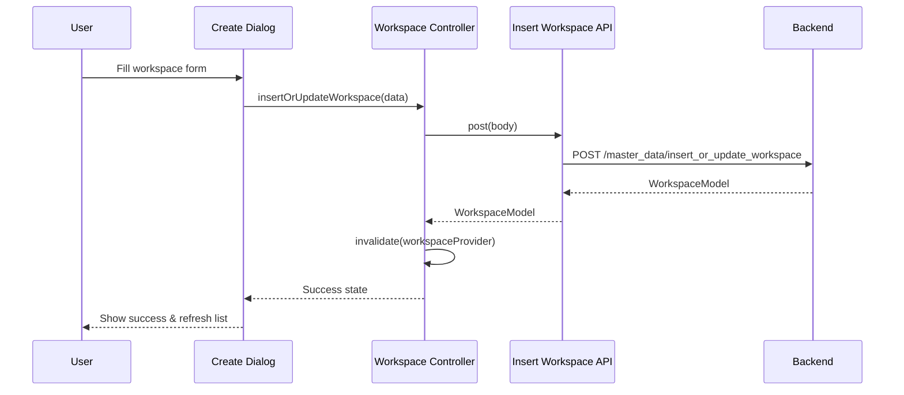

#### 2. Create Project
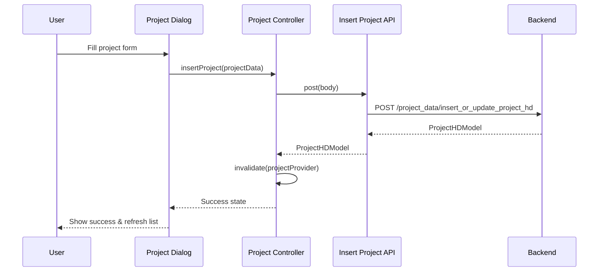

#### 3. Create Task
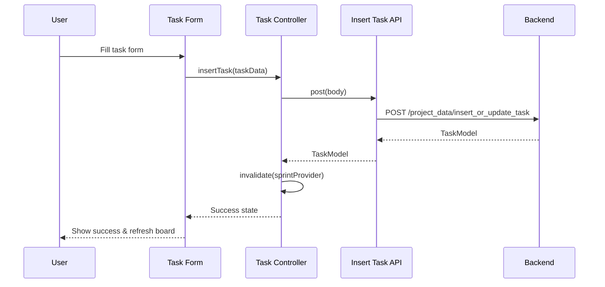

#### 4. Create Sprint
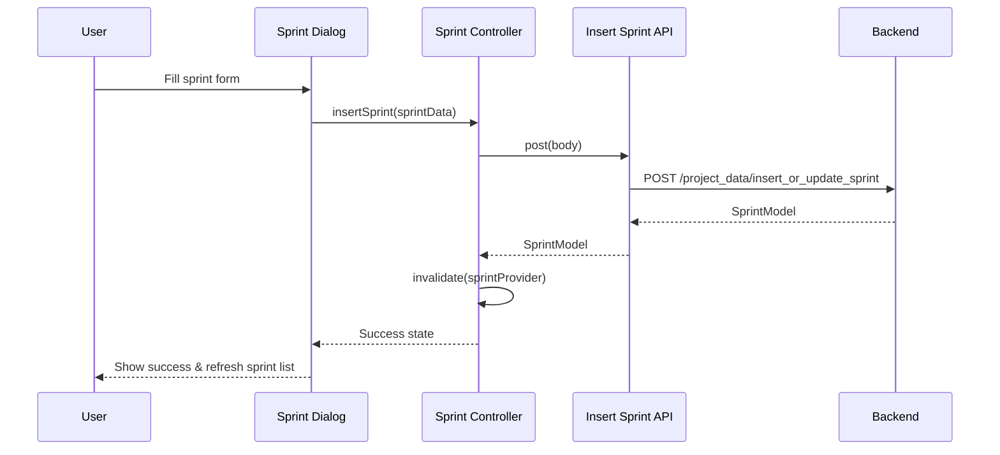

#### 5. Create/Update User Profile
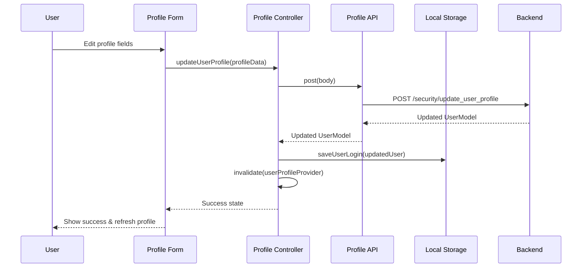

### Read Operations

#### 1. Read Workspaces
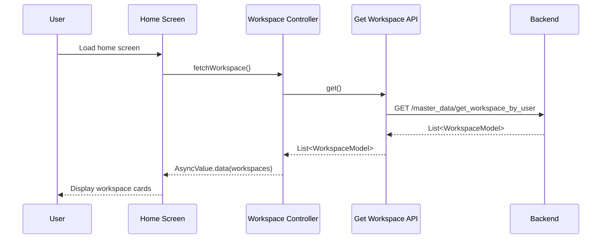

#### 2. Read Projects
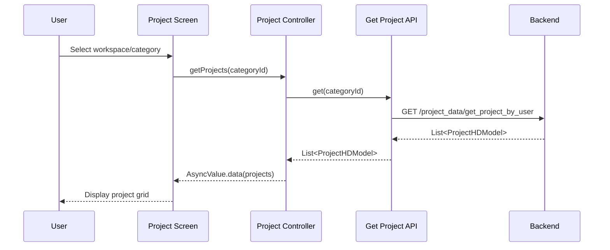

#### 3. Read Tasks/Sprints
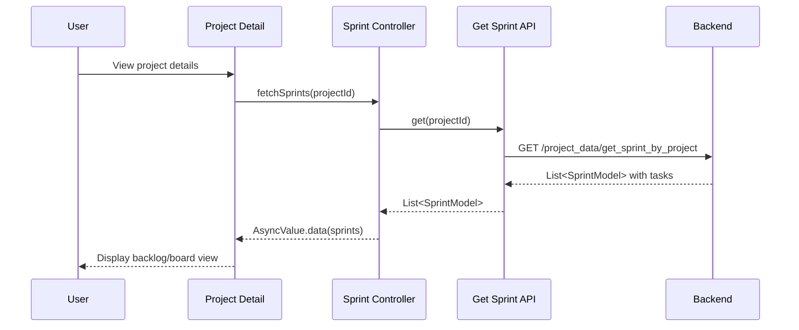

#### 4. Read User Profile
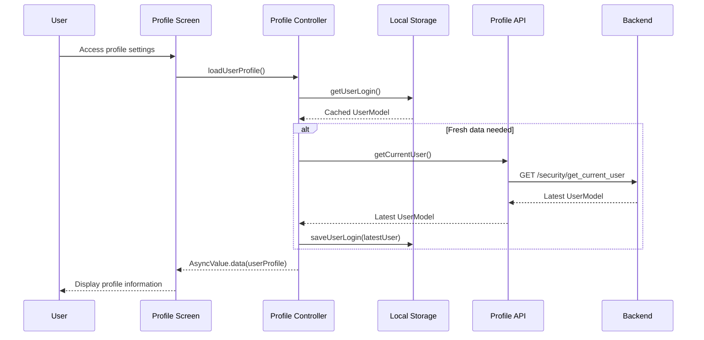

### Update Operations

#### 1. Update Workspace
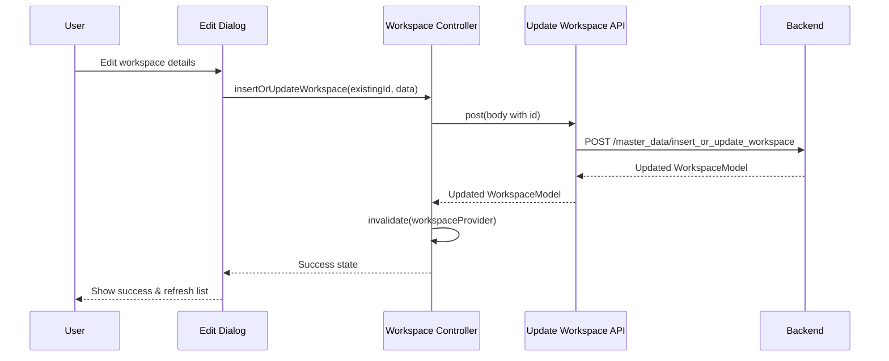

#### 2. Update Task Status (Drag & Drop)
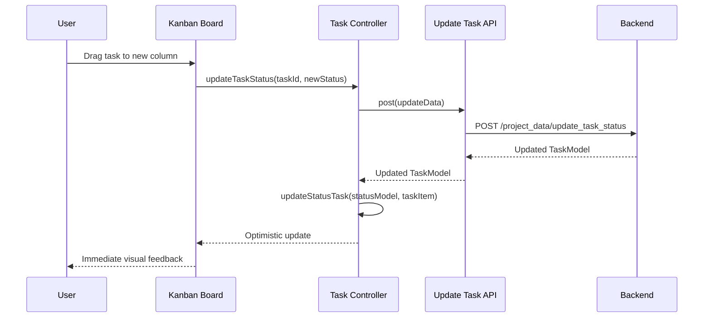

#### 3. Update Project
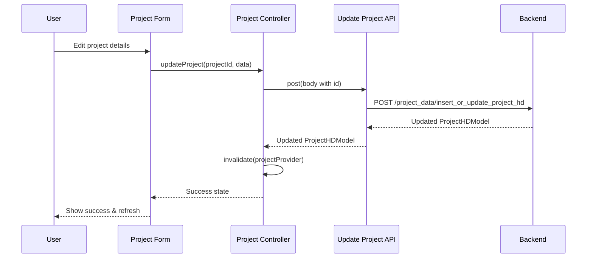

#### 4. Update User Profile
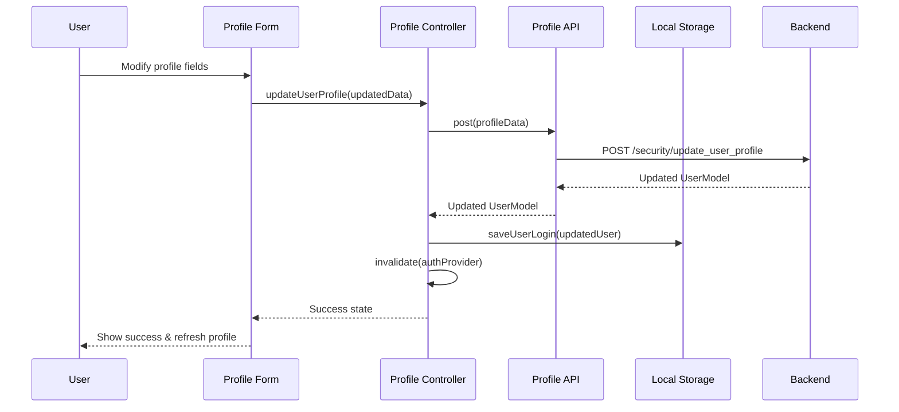

#### 5. Change Password
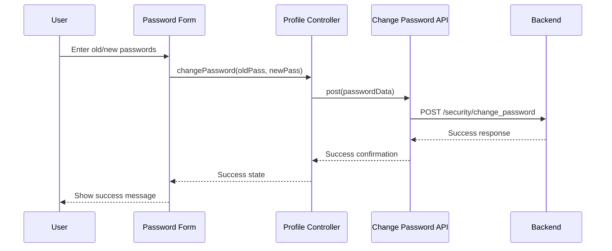

#### 6. Upload Avatar
```mermaid
sequenceDiagram
    participant U as User
    participant UI as Avatar Upload
    participant PC as Profile Controller
    participant API as Upload API
    participant LS as Local Storage
    participant BE as Backend
    
    U->>UI: Select new avatar image
    UI->>PC: uploadAvatar(imageFile)
    PC->>API: postMultipart(imageFile)
    API->>BE: POST /security/upload_avatar
    BE-->>API: Image URL & Updated UserModel
    API-->>PC: Updated UserModel
    PC->>LS: saveUserLogin(updatedUser)
    PC-->>UI: Success state
    UI-->>U: Display new avatar
```

### Delete Operations

#### 1. Delete Workspace Role (Remove User)
```mermaid
sequenceDiagram
    participant U as User
    participant UI as User Management
    participant WC as Workspace Controller
    participant API as Delete Role API
    participant BE as Backend
    
    U->>UI: Click remove user
    UI->>WC: deleteUserFromWorkspace(workspaceId, userId)
    WC->>API: delete(workspaceId, userId)
    API->>BE: DELETE /master_data/delete_workspace_role
    BE-->>API: Success response
    API-->>WC: Boolean success
    WC->>WC: invalidate(workspaceRolesProvider)
    WC-->>UI: Success state
    UI-->>U: Remove user from list
```

#### 2. Delete Project
```mermaid
sequenceDiagram
    participant U as User
    participant UI as Project Actions
    participant PC as Project Controller
    participant API as Delete Project API
    participant BE as Backend
    
    U->>UI: Confirm delete project
    UI->>PC: deleteProject(projectId)
    PC->>API: delete(projectId)
    API->>BE: DELETE /project_data/delete_project_hd
    BE-->>API: Success response
    API-->>PC: Success confirmation
    PC->>PC: invalidate(projectProvider)
    PC-->>UI: Success state
    UI-->>U: Remove project & show message
```

#### 3. Delete Sprint
```mermaid
sequenceDiagram
    participant U as User
    participant UI as Sprint Actions
    participant SC as Sprint Controller
    participant API as Delete Sprint API
    participant BE as Backend
    
    U->>UI: Confirm delete sprint
    UI->>SC: deleteSprint(sprintId)
    SC->>API: delete(sprintId)
    API->>BE: DELETE /project_data/delete_sprint
    BE-->>API: Success message
    API-->>SC: Success message
    SC->>SC: invalidate(sprintProvider)
    SC-->>UI: Success state
    UI-->>U: Remove sprint & refresh
```

#### 4. Delete Category
```mermaid
sequenceDiagram
    participant U as User
    participant UI as Category Menu
    participant CC as Category Controller
    participant API as Delete Category API
    participant BE as Backend
    
    U->>UI: Confirm delete category
    UI->>CC: deleteCategory(categoryId)
    CC->>API: delete(categoryId)
    API->>BE: DELETE /project_data/delete_project_category
    BE-->>API: Success response
    API-->>CC: Success confirmation
    CC->>CC: invalidate(categoryProvider)
    CC-->>UI: Success state
    UI-->>U: Remove category & refresh
```

## CRUD API Endpoints Summary

### Create/Update Endpoints
| Endpoint | Method | Purpose |
|----------|--------|---------|
| `/master_data/insert_or_update_workspace` | POST | Create/Update workspace |
| `/project_data/insert_or_update_project_hd` | POST | Create/Update project |
| `/project_data/insert_or_update_sprint` | POST | Create/Update sprint |
| `/project_data/insert_or_update_task` | POST | Create/Update task |
| `/project_data/insert_or_update_project_category` | POST | Create/Update category |
| `/security/update_user_profile` | POST | Update user profile |
| `/security/change_password` | POST | Change user password |
| `/security/upload_avatar` | POST | Upload profile avatar |

### Read Endpoints
| Endpoint | Method | Purpose |
|----------|--------|---------|
| `/master_data/get_workspace_by_user` | GET | Get user workspaces |
| `/project_data/get_project_by_user` | GET | Get user projects |
| `/project_data/get_sprint_by_project` | GET | Get project sprints |
| `/project_data/get_task_by_sprint_started` | GET | Get sprint tasks |
| `/project_data/get_project_category_by_user` | GET | Get user categories |
| `/security/get_current_user` | GET | Get current user profile |

### Delete Endpoints
| Endpoint | Method | Purpose |
|----------|--------|---------|
| `/master_data/delete_workspace_role` | DELETE | Remove user from workspace |
| `/project_data/delete_project_hd` | DELETE | Delete project |
| `/project_data/delete_sprint` | DELETE | Delete sprint |
| `/project_data/delete_project_category` | DELETE | Delete category |

## CRUD Error Handling

### Common Error Patterns
```dart
// Profile Controller Pattern
class ProfileController extends StateNotifier<AsyncValue<UserModel?>> {
  final Ref ref;
  ProfileController(this.ref) : super(const AsyncValue.data(null));

  Future<void> updateProfile(Map<String, dynamic> profileData) async {
    state = const AsyncValue.loading();
    state = await AsyncValue.guard(() async {
      try {
        final result = await ref.read(profileApiProvider).updateProfile(profileData);
        // Update local storage
        await ref.read(localStorageServiceProvider).saveUserLogin(result);
        // Invalidate auth provider to refresh user data
        ref.invalidate(isLoggedInProvider);
        return result;
      } catch (e) {
        // Show error to user
        rethrow;
      }
    });
  }

  Future<void> changePassword(String oldPassword, String newPassword) async {
    state = const AsyncValue.loading();
    state = await AsyncValue.guard(() async {
      final success = await ref.read(profileApiProvider).changePassword({
        'old_password': oldPassword,
        'new_password': newPassword,
      });
      if (!success) throw Exception('Failed to change password');
      return state.value; // Return current user data
    });
  }

  Future<void> uploadAvatar(File imageFile) async {
    state = const AsyncValue.loading();
    state = await AsyncValue.guard(() async {
      final updatedUser = await ref.read(profileApiProvider).uploadAvatar(imageFile);
      await ref.read(localStorageServiceProvider).saveUserLogin(updatedUser);
      ref.invalidate(isLoggedInProvider);
      return updatedUser;
    });
  }
}

// UI Pattern
Consumer(
  builder: (context, ref, child) {
    final profileState = ref.watch(profileControllerProvider);
    return profileState.when(
      data: (user) => ProfileForm(user: user),
      loading: () => const ProfileFormSkeleton(),
      error: (error, stack) => ProfileErrorWidget(
        error: error.toString(),
        onRetry: () => ref.refresh(profileControllerProvider),
      ),
    );
  }
)
```

### Profile-specific Error Handling
```dart
// Avatar Upload Error Handling
Future<void> uploadAvatar(File imageFile) async {
  try {
    // Validate file size (max 5MB)
    if (imageFile.lengthSync() > 5 * 1024 * 1024) {
      throw Exception('ไฟล์รูปภาพต้องมีขนาดไม่เกิน 5MB');
    }
    
    // Validate file type
    final extension = imageFile.path.split('.').last.toLowerCase();
    if (!['jpg', 'jpeg', 'png', 'gif'].contains(extension)) {
      throw Exception('รองรับเฉพาะไฟล์ JPG, PNG, GIF เท่านั้น');
    }
    
    await ref.read(profileControllerProvider.notifier).uploadAvatar(imageFile);
  } catch (e) {
    // Show specific error message
    ScaffoldMessenger.of(context).showSnackBar(
      SnackBar(content: Text(e.toString())),
    );
  }
}

// Password Change Validation
Future<void> changePassword() async {
  if (oldPasswordController.text.isEmpty || newPasswordController.text.isEmpty) {
    throw Exception('กรุณากรอกรหัสผ่านเก่าและใหม่');
  }
  
  if (newPasswordController.text.length < 8) {
    throw Exception('รหัสผ่านใหม่ต้องมีอย่างน้อย 8 ตัวอักษร');
  }
  
  if (newPasswordController.text != confirmPasswordController.text) {
    throw Exception('รหัสผ่านใหม่และยืนยันรหัสผ่านไม่ตรงกัน');
  }
}
```

### Optimistic Updates
- **Task Status Changes**: อัพเดท UI ทันทีก่อนเรียก API
- **List Operations**: เพิ่ม/ลบรายการใน local state ก่อน
- **Profile Updates**: แสดงข้อมูลใหม่ทันทีในขณะที่อัพโหลด
- **Avatar Changes**: แสดงรูปใหม่ทันทีก่อนอัพโหลดเสร็จ
- **Rollback**: ย้อนกลับหาก API call ล้มเหลว

## Data Validation Flow

### Client-side Validation
1. **Form Validation**: ตรวจสอบ required fields
2. **Business Rules**: ตรวจสอบกฎทางธุรกิจ
3. **Data Types**: ตรวจสอบ format และ type
4. **Profile Validation**: 
   - Email format validation
   - Phone number format
   - Password strength requirements
   - Image file type and size validation

### Server-side Validation
1. **API Validation**: Backend ตรวจสอบข้อมูล
2. **Error Response**: ส่งกลับ validation errors
3. **UI Feedback**: แสดง error messages ให้ user
4. **Security Validation**:
   - Token authentication for profile updates
   - Old password verification for password changes
   - File type and size validation for uploads
   - Rate limiting for sensitive operations

## Real-time Updates

### Auto Update Manager
- ตรวจสอบ updates สำหรับ desktop apps
- Version control และ deployment

---

*Diagram นี้แสดงการไหลของข้อมูลในระบบ OHO Task Management ตั้งแต่ UI layer จนถึง Backend APIs โดยใช้ Clean Architecture pattern ร่วมกับ Riverpod state management รวมถึง CRUD operations ที่ครอบคลุมทุกฟังก์ชันการทำงาน*