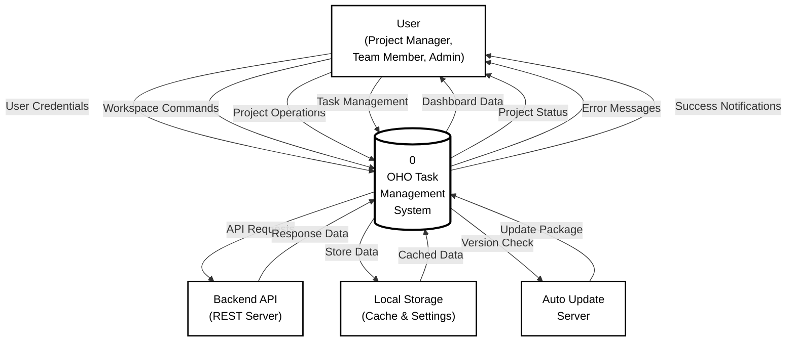

# OHO Task Management System - Data Flow Diagram

## ภาพรวมระบบ
OHO Task Management System เป็นแอปพลิเคชัน Flutter สำหรับจัดการงานและโปรเจค ที่ใช้สถาปัตยกรรม Clean Architecture พร้อม Riverpod เป็น State Management

---

## 📊 Context Diagram (Level 0)



---

## 🔄 Data Flow Diagram Level 1

```mermaid
flowchart TD
    %% ============= EXTERNAL ENTITIES =============
    USER1["User<br/>(Project Manager)"]
    USER2["User<br/>(Team Member)"]
    USER3["User<br/>(Admin)"]
    BACKEND["Backend API<br/>(REST Server)"]
    STORAGE["Local Storage"]
    UPDATE["Auto Update<br/>Server"]
    
    %% ============= PROCESSES =============
    P1["1.0<br/><br/>Authentication<br/>Management"]
    P2["2.0<br/><br/>Workspace<br/>Management"] 
    P3["3.0<br/><br/>Project<br/>Management"]
    P4["4.0<br/><br/>Task<br/>Management"]
    P5["5.0<br/><br/>Profile<br/>Management"]
    P6["6.0<br/><br/>System<br/>Configuration"]
    P7["7.0<br/><br/>Data<br/>Synchronization"]
    P8["8.0<br/><br/>Auto Update<br/>Management"]
    
    %% ============= DATA STORES =============
    DS1["|D1| User Accounts"]
    DS2["|D2| Workspace Data"] 
    DS3["|D3| Project Data"]
    DS4["|D4| Task Data"]
    DS5["|D5| Activity Log"]
    DS6["|D6| System Settings"]
    
    %% ============= USER AUTHENTICATION FLOWS =============
    USER1 -->|Login credentials| P1
    USER2 -->|Login credentials| P1
    USER3 -->|Login credentials| P1
    P1 -->|Authentication status| USER1
    P1 -->|Authentication status| USER2
    P1 -->|Authentication status| USER3
    
    %% ============= WORKSPACE MANAGEMENT FLOWS =============
    USER1 -->|Create workspace| P2
    USER1 -->|Manage workspace| P2
    USER3 -->|Admin workspace commands| P2
    P2 -->|Workspace list| USER1
    P2 -->|Workspace access| USER2
    P2 -->|Admin workspace data| USER3
    
    %% ============= PROJECT MANAGEMENT FLOWS =============
    USER1 -->|Create project| P3
    USER1 -->|Manage categories| P3
    USER2 -->|View projects| P3
    P3 -->|Project dashboard| USER1
    P3 -->|Project list| USER2
    P3 -->|Project reports| USER3
    
    %% ============= TASK MANAGEMENT FLOWS =============
    USER1 -->|Create tasks| P4
    USER1 -->|Assign tasks| P4
    USER2 -->|Update task status| P4
    USER2 -->|Add comments| P4
    P4 -->|Task board| USER1
    P4 -->|My tasks| USER2
    P4 -->|Task reports| USER3
    
    %% ============= PROFILE MANAGEMENT FLOWS =============
    USER1 -->|Update profile| P5
    USER2 -->|Update profile| P5
    USER3 -->|Update profile| P5
    P5 -->|Profile data| USER1
    P5 -->|Profile data| USER2
    P5 -->|Profile data| USER3
    
    %% ============= SYSTEM CONFIGURATION FLOWS =============
    USER1 -->|App settings| P6
    USER2 -->|User preferences| P6
    USER3 -->|System settings| P6
    P6 -->|Settings view| USER1
    P6 -->|Preferences view| USER2
    P6 -->|Admin settings| USER3
    
    %% ============= DATA SYNCHRONIZATION FLOWS =============
    P7 -->|Sync status| USER1
    P7 -->|Sync status| USER2
    P7 -->|Sync reports| USER3
    
    %% ============= AUTO UPDATE FLOWS =============
    P8 -->|Update notifications| USER1
    P8 -->|Update notifications| USER2
    P8 -->|Update notifications| USER3
    
    %% ============= BACKEND API FLOWS =============
    P1 <-->|Login requests/responses| BACKEND
    P2 <-->|Workspace API calls| BACKEND
    P3 <-->|Project API calls| BACKEND
    P4 <-->|Task API calls| BACKEND
    P5 <-->|Profile API calls| BACKEND
    P7 <-->|Sync API calls| BACKEND
    
    %% ============= LOCAL STORAGE FLOWS =============
    P1 <-->|Token storage| STORAGE
    P2 <-->|Workspace cache| STORAGE
    P3 <-->|Project cache| STORAGE
    P4 <-->|Task cache| STORAGE
    P5 <-->|Profile cache| STORAGE
    P6 <-->|Settings data| STORAGE
    P7 <-->|Sync data| STORAGE
    
    %% ============= AUTO UPDATE SERVER FLOWS =============
    P8 <-->|Version check/updates| UPDATE
    
    %% ============= DATA STORE INTERACTIONS =============
    P1 -->|User login data| DS1
    DS1 -->|User credentials| P1
    
    P2 -->|Workspace info| DS2
    DS2 -->|Workspace data| P2
    
    P3 -->|Project info| DS3
    DS3 -->|Project data| P3
    
    P4 -->|Task info| DS4
    DS4 -->|Task data| P4
    
    P5 -->|Profile updates| DS1
    DS1 -->|User profile| P5
    
    P6 -->|Configuration| DS6
    DS6 -->|Settings data| P6
    
    P7 -->|Activity logs| DS5
    DS5 -->|Log data| P7
    
    P8 -->|Update info| DS6
    DS6 -->|Version data| P8
    
    %% ============= INTER-PROCESS FLOWS =============
    P1 -->|Authenticated user| P2
    P2 -->|Selected workspace| P3
    P3 -->|Project context| P4
    P4 -->|Task updates| P7
    P5 -->|Profile changes| P1
    P6 -->|Config changes| P7
    
    %% ============= STYLING =============
    classDef entityStyle fill:#ffffff,stroke:#000000,stroke-width:2px,color:#000000
    classDef processStyle fill:#ffffff,stroke:#000000,stroke-width:2px,color:#000000
    classDef datastoreStyle fill:#ffffff,stroke:#000000,stroke-width:1px,color:#000000
    
    class USER1,USER2,USER3,BACKEND,STORAGE,UPDATE entityStyle
    class P1,P2,P3,P4,P5,P6,P7,P8 processStyle
    class DS1,DS2,DS3,DS4,DS5,DS6 datastoreStyle
```



### หน่วยงานภายนอก (External Entities)
1. **👤 User** - ผู้ใช้ระบบ (Project Manager, Team Member, Admin)
2. **🗄️ OHO Backend API** - ระบบ Backend สำหรับการจัดเก็บข้อมูล
3. **💾 Local Storage** - ที่เก็บข้อมูลในเครื่อง (Token, Cache, User Preferences)
4. **📱 Auto Update Server** - เซิร์ฟเวอร์สำหรับอัพเดทแอปพลิเคชัน

```mermaid
flowchart TD
    %% External Entities
    USER["👤 User<br/>(Project Manager,<br/>Team Member, Admin)"]
    BACKEND["🗄️ OHO Backend API<br/>(REST API Server)"]
    STORAGE["💾 Local Storage<br/>(Token, Cache,<br/>User Preferences)"]
    UPDATE_SERVER["📱 Auto Update Server<br/>(Desktop App Updates)"]
    
    %% Main System Process
    SYSTEM["🎯 OHO Task Management System<br/><br/>📱 Flutter Application<br/>🏗️ Clean Architecture<br/>⚡ Riverpod State Management"]
    
    %% Data Stores
    DS1[("🏢 D1: Workspace Data<br/>(Workspaces, Users, Roles)")]
    DS2[("📋 D2: Project Data<br/>(Categories, Projects,<br/>Sprints, Tasks)")]
    DS3[("👤 D3: User Data<br/>(Profile, Authentication,<br/>Permissions)")]
    DS4[("📊 D4: Activity Data<br/>(Comments, History,<br/>Status Changes)")]
    DS5[("⚙️ D5: System Data<br/>(Settings, Configurations,<br/>App State)")]
    
    %% User Interactions - Input Data Flows
    USER -->|"🔐 1.1 Login Credentials<br/>(username, password)"| SYSTEM
    USER -->|"🏢 1.2 Workspace Management<br/>(create, edit, delete workspace)"| SYSTEM
    USER -->|"📋 1.3 Project Operations<br/>(create project, manage categories)"| SYSTEM
    USER -->|"📝 1.4 Task Management<br/>(create, edit, move tasks)"| SYSTEM
    USER -->|"👥 1.5 User Management<br/>(add/remove team members)"| SYSTEM
    USER -->|"👤 1.6 Profile Updates<br/>(edit profile, change password)"| SYSTEM
    USER -->|"⚙️ 1.7 App Settings<br/>(preferences, configurations)"| SYSTEM
    
    %% System Output to User
    SYSTEM -->|"🎯 2.1 Dashboard Views<br/>(workspace list, project overview)"| USER
    SYSTEM -->|"📊 2.2 Project Status<br/>(kanban board, gantt chart)"| USER
    SYSTEM -->|"📈 2.3 Progress Reports<br/>(sprint progress, team workload)"| USER
    SYSTEM -->|"🔔 2.4 Notifications<br/>(updates, error messages)"| USER
    SYSTEM -->|"✅ 2.5 Operation Results<br/>(success/error confirmations)"| USER
    
    %% Backend API Interactions
    SYSTEM -->|"🔐 3.1 Authentication Requests<br/>(login, token validation)"| BACKEND
    BACKEND -->|"🎫 3.2 Authentication Response<br/>(access token, user data)"| SYSTEM
    
    SYSTEM -->|"🏢 3.3 Workspace API Calls<br/>(CRUD operations)"| BACKEND
    BACKEND -->|"🏢 3.4 Workspace Data<br/>(workspace list, user roles)"| SYSTEM
    
    SYSTEM -->|"📋 3.5 Project API Calls<br/>(project management)"| BACKEND
    BACKEND -->|"📋 3.6 Project Data<br/>(projects, categories, sprints)"| SYSTEM
    
    SYSTEM -->|"📝 3.7 Task API Calls<br/>(task operations)"| BACKEND
    BACKEND -->|"📝 3.8 Task Data<br/>(task list, status, comments)"| SYSTEM
    
    SYSTEM -->|"👤 3.9 Profile API Calls<br/>(profile updates)"| BACKEND
    BACKEND -->|"👤 3.10 Updated Profile<br/>(user information)"| SYSTEM
    
    %% Local Storage Interactions
    SYSTEM -->|"💾 4.1 Store Session Data<br/>(token, user login)"| STORAGE
    SYSTEM -->|"💾 4.2 Cache App Data<br/>(workspace, project cache)"| STORAGE
    SYSTEM -->|"💾 4.3 Save Preferences<br/>(app settings, UI state)"| STORAGE
    
    STORAGE -->|"🎫 4.4 Session Recovery<br/>(stored token, user data)"| SYSTEM
    STORAGE -->|"📦 4.5 Cached Data<br/>(offline data access)"| SYSTEM
    STORAGE -->|"⚙️ 4.6 User Preferences<br/>(saved settings)"| SYSTEM
    
    %% Auto Update Server (Desktop Only)
    SYSTEM -->|"🔍 5.1 Version Check<br/>(current app version)"| UPDATE_SERVER
    UPDATE_SERVER -->|"📦 5.2 Update Available<br/>(new version info)"| SYSTEM
    SYSTEM -->|"⬇️ 5.3 Download Request<br/>(update package)"| UPDATE_SERVER
    UPDATE_SERVER -->|"📦 5.4 Update Package<br/>(new app version)"| SYSTEM
    
    %% Internal Data Store Operations
    SYSTEM -.->|"📝 Read/Write"| DS1
    SYSTEM -.->|"📝 Read/Write"| DS2
    SYSTEM -.->|"📝 Read/Write"| DS3
    SYSTEM -.->|"📝 Read/Write"| DS4
    SYSTEM -.->|"📝 Read/Write"| DS5
    
    %% Styling
    classDef userStyle fill:#e1f5fe,stroke:#0277bd,stroke-width:3px,color:#000
    classDef systemStyle fill:#f3e5f5,stroke:#7b1fa2,stroke-width:4px,color:#000
    classDef backendStyle fill:#e8f5e8,stroke:#2e7d32,stroke-width:3px,color:#000
    classDef storageStyle fill:#fff3e0,stroke:#ef6c00,stroke-width:3px,color:#000
    classDef datastoreStyle fill:#fce4ec,stroke:#c2185b,stroke-width:2px,color:#000
    
    class USER userStyle
    class SYSTEM systemStyle
    class BACKEND,UPDATE_SERVER backendStyle
    class STORAGE storageStyle
    class DS1,DS2,DS3,DS4,DS5 datastoreStyle
```



---

## 📋 Process Specifications

### 🔐 **Process 1.0: Authentication Management**
- **Input**: Login credentials จาก User
- **Process**: 
  - รับ username และ password
  - ส่งไปตรวจสอบที่ Backend API
  - รับ auth token กลับมา
  - เก็บ token ใน Local Storage
- **Output**: Authentication status กลับไป User
- **Data Store**: D1 (User Accounts)

### � **Process 2.0: Workspace Management**
- **Input**: Workspace commands จาก User
- **Process**: 
  - จัดการ CRUD operations สำหรับ workspace
  - ตรวจสอบ user permissions
  - ซิงค์ข้อมูลกับ Backend API
- **Output**: Workspace list กลับไป User
- **Data Store**: D2 (Workspace Data)

### 📋 **Process 3.0: Project Management**
- **Input**: Project operations จาก User
- **Process**: 
  - จัดการ project และ category
  - สร้าง sprint และ milestone
  - อัพเดทข้อมูลผ่าน Backend API
- **Output**: Project dashboard กลับไป User
- **Data Store**: D3 (Project Data)

### 📝 **Process 4.0: Task Management**
- **Input**: Task actions จาก User
- **Process**: 
  - จัดการ task CRUD operations
  - อัพเดท status และ assignment
  - บันทึก activity ใน log
- **Output**: Task board กลับไป User
- **Data Store**: D4 (Task Data), D5 (Activity Log)

### 👤 **Process 5.0: Profile Management**
- **Input**: Profile updates จาก User
- **Process**: 
  - แก้ไขข้อมูลส่วนตัว
  - เปลี่ยนรหัสผ่าน
  - อัพโหลดรูปโปรไฟล์
- **Output**: Profile data กลับไป User
- **Data Store**: D1 (User Accounts)

### ⚙️ **Process 6.0: System Configuration**
- **Input**: App settings จาก User
- **Process**: 
  - จัดการ user preferences
  - บันทึก app configurations
  - ตั้งค่า theme และ language
- **Output**: Settings view กลับไป User
- **Data Store**: D6 (System Settings)

### 🔄 **Process 7.0: Data Synchronization**
- **Input**: Cached data จาก Local Storage
- **Process**: 
  - ซิงค์ข้อมูลระหว่าง local และ backend
  - จัดการ offline mode
  - บันทึก sync activity
- **Output**: Sync status กลับไป User
- **Data Store**: D5 (Activity Log)

### 🔧 **Process 8.0: Auto Update Management**
- **Input**: Version check จาก System
- **Process**: 
  - ตรวจสอบ app version ล่าสุด
  - ดาวน์โหลดและติดตั้ง update
  - แจ้งเตือน user
- **Output**: Update notifications กลับไป User
- **Data Store**: D6 (System Settings)

---

## 🗂️ Data Store Specifications

### **D1: User Accounts**
- User login credentials และ authentication data
- User profile information (name, email, avatar)
- User roles และ permissions
- Session data และ access tokens

### **D2: Workspace Data**
- Workspace information (name, description, settings)
- User roles within workspaces
- Workspace permissions และ access control
- Team member lists

### **D3: Project Data**
- Project details (name, description, status)
- Project categories และ classifications
- Sprint information และ timelines
- Project milestones และ deadlines

### **D4: Task Data**
- Task details (title, description, priority)
- Task status และ progress tracking
- Task assignments และ ownership
- Task dependencies และ relationships

### **D5: Activity Log**
- User activity history
- System event logs
- Comment และ discussion threads
- Change tracking และ audit trails

### **D6: System Settings**
- Application configuration settings
- User preferences และ customizations
- Cache management data
- Auto-update information และ version control

---

## 🔄 Data Flow Summary

| Flow Type | Description | Direction |
|-----------|-------------|-----------|
| **User Input** | การป้อนข้อมูลจากผู้ใช้ | User → Process |
| **System Output** | การแสดงผลกลับไปยังผู้ใช้ | Process → User |
| **API Communication** | การสื่อสารกับ Backend | Process ↔ Backend API |
| **Local Storage** | การจัดเก็บข้อมูลในเครื่อง | Process ↔ Local Storage |
| **Data Persistence** | การเก็บข้อมูลถาวร | Process ↔ Data Store |
| **Inter-Process** | การสื่อสารระหว่าง Process | Process → Process |

---

*Data Flow Diagram นี้แสดงการไหลของข้อมูลในระบบ OHO Task Management ในรูปแบบ traditional DFD notation ที่เป็นมาตรฐานและเข้าใจง่าย เหมาะสำหรับการนำเสนอทางวิชาการและเป็นเอกสารอ้างอิงสำหรับการพัฒนาระบบ*

```mermaid
graph LR
    subgraph AUTH["� Authentication Layer"]
        A1[Login] --> A2[Validate] --> A3[Session]
    end
    
    subgraph WORK["🏢 Workspace Layer"] 
        W1[Create] --> W2[Manage] --> W3[Collaborate]
    end
    
    subgraph PROJ["�📋 Project Layer"]
        P1[Plan] --> P2[Execute] --> P3[Monitor]
    end
    
    subgraph TASK["📝 Task Layer"]
        T1[Create] --> T2[Assign] --> T3[Track] --> T4[Complete]
    end
    
    AUTH --> WORK
    WORK --> PROJ  
    PROJ --> TASK
    
    classDef authStyle fill:#e8f5e8,stroke:#4caf50,stroke-width:2px
    classDef workStyle fill:#e3f2fd,stroke:#2196f3,stroke-width:2px
    classDef projStyle fill:#fff3e0,stroke:#ff9800,stroke-width:2px
    classDef taskStyle fill:#fce4ec,stroke:#e91e63,stroke-width:2px
    
    class A1,A2,A3 authStyle
    class W1,W2,W3 workStyle
    class P1,P2,P3 projStyle
    class T1,T2,T3,T4 taskStyle
```

---

## 📊 Data Flow Matrix

| Process | Input Data | Output Data | Data Store | External Entity |
|---------|------------|-------------|------------|-----------------|
| **🔐 P1: Authentication** | User Credentials | Auth Status | D1: User Accounts | Backend API |
| **🏢 P2: Workspace** | Workspace Commands | Workspace List | D2: Workspace Data | Backend API |
| **📋 P3: Project** | Project Operations | Project Dashboard | D3: Project Data | Backend API |
| **📝 P4: Task** | Task Actions | Task Board | D4: Task Data | Backend API |
| **👤 P5: Profile** | Profile Updates | Profile Info | D1: User Accounts | Backend API |
| **⚙️ P6: System** | App Settings | Settings View | D6: System Settings | Local Storage |
| **🔄 P7: Sync** | Cached Data | Sync Status | D5: Activity Log | Backend API |
| **🔧 P8: Update** | Version Check | Update Alerts | D6: System Settings | Update Server |

---

## 🌊 Data Flow Patterns

### 🔄 **Real-time Data Flow**
```
User Action → UI Event → State Change → API Call → Backend → Database
     ↓
User Interface ← State Update ← Response Handler ← API Response ← Backend
```

### 💾 **Caching Flow Pattern**
```
API Request → Check Cache → [Cache Hit] → Return Cached Data
                    ↓
            [Cache Miss] → API Call → Store in Cache → Return Fresh Data
```

### 🔐 **Authentication Flow Pattern**
```
Login Request → Validate Credentials → Generate Token → Store Session
      ↓
Auto Refresh → Check Token Expiry → Refresh Token → Update Session
```

### 📱 **Offline-First Pattern**
```
User Action → Update Local State → Queue API Call → Sync When Online
     ↓
Show Optimistic UI → Handle Success/Failure → Update Final State
```

### 🔐 Process 1: Authentication Management
- **Input**: Login Credentials จาก User
- **Process**: 
  - ตรวจสอบ username และ password
  - เรียก Backend API เพื่อ validate
  - สร้าง session และเก็บ token
- **Output**: Authentication Status กลับไป User
- **Data Store**: D1 (User Accounts)

### 🏢 Process 2: Workspace Management  
- **Input**: Workspace Commands จาก User
- **Process**: 
  - จัดการ CRUD operations สำหรับ workspace
  - ตรวจสอบ user permissions
  - อัพเดทข้อมูลผ่าน Backend API
- **Output**: Workspace List กลับไป User
- **Data Store**: D2 (Workspace Data)

### 📋 Process 3: Project Management
- **Input**: Project Operations จาก User  
- **Process**: 
  - จัดการ project และ category
  - สร้าง sprint และ milestone
  - ซิงค์ข้อมูลกับ Backend
- **Output**: Project Dashboard กลับไป User
- **Data Store**: D3 (Project Data)

### 📝 Process 4: Task Management
- **Input**: Task Actions จาก User
- **Process**: 
  - จัดการ task CRUD operations
  - อัพเดท status และ assignment
  - บันทึก activity log
- **Output**: Task Board กลับไป User
- **Data Store**: D4 (Task Data), D5 (Activity Log)

### 👤 Process 5: Profile Management
- **Input**: Profile Updates จาก User
- **Process**: 
  - แก้ไขข้อมูลส่วนตัว
  - เปลี่ยนรหัสผ่าน
  - อัพโหลดรูปโปรไฟล์
- **Output**: Profile Data กลับไป User
- **Data Store**: D1 (User Accounts)

### ⚙️ Process 6: System Configuration
- **Input**: App Settings จาก User
- **Process**: 
  - จัดการ user preferences
  - บันทึก app configurations
  - ตั้งค่า theme และ language
- **Output**: Settings View กลับไป User
- **Data Store**: D6 (System Settings)

### 🔄 Process 7: Data Synchronization
- **Input**: Cached Data จาก Local Storage
- **Process**: 
  - ซิงค์ข้อมูลระหว่าง local และ backend
  - จัดการ offline mode
  - บันทึก sync activity
- **Output**: Sync Status กลับไป User
- **Data Store**: D5 (Activity Log)

### 📱 Process 8: Auto Update Management
- **Input**: Version Check จาก System
- **Process**: 
  - ตรวจสอบ app version ล่าสุด
  - ดาวน์โหลดและติดตั้ง update
  - แจ้งเตือน user
- **Output**: Update Notifications กลับไป User
- **Data Store**: D6 (System Settings)

---

## 🗂️ Data Store Specifications

### |D1| User Accounts
- **UserModel**: ข้อมูลผู้ใช้ (id, name, email, role)
- **UserLoginModel**: session data และ access token
- **ProfileSettings**: การตั้งค่าส่วนตัว

### |D2| Workspace Data
- **WorkspaceModel**: ข้อมูล workspace (id, name, description)
- **UserRoleModel**: บทบาทของ user ใน workspace
- **PermissionModel**: สิทธิ์การเข้าถึง

### |D3| Project Data  
- **CategoryModel**: หมวดหมู่โปรเจค
- **ProjectHDModel**: ข้อมูลโปรเจค
- **SprintModel**: Sprint และ milestone

### |D4| Task Data
- **TaskModel**: ข้อมูลงาน/Task
- **TaskStatusModel**: สถานะของงาน
- **AssignmentModel**: การมอบหมายงาน

### |D5| Activity Log
- **CommentModel**: ความคิดเห็นและการสนทนา
- **ActivityTypeModel**: ประเภทกิจกรรม
- **HistoryLog**: ประวัติการเปลี่ยนแปลง

### |D6| System Settings
- **AppConfiguration**: การตั้งค่าแอปพลิเคชัน
- **CacheData**: ข้อมูล cache
- **UpdateInfo**: ข้อมูล version และ update

---

## 🚀 Data Flow Summary

### Input Data Flows (จาก User เข้าสู่ระบบ)
1. **Login Credentials** → Process 1
2. **Workspace Commands** → Process 2  
3. **Project Operations** → Process 3
4. **Task Actions** → Process 4
5. **Profile Updates** → Process 5
6. **App Settings** → Process 6

### Output Data Flows (จากระบบไป User)
1. **Authentication Status** ← Process 1
2. **Workspace List** ← Process 2
3. **Project Dashboard** ← Process 3
4. **Task Board** ← Process 4
5. **Profile Data** ← Process 5
6. **Settings View** ← Process 6
7. **Sync Status** ← Process 7
8. **Update Notifications** ← Process 8

### External System Interactions
- **Backend API**: การซิงค์ข้อมูลหลัก
- **Local Storage**: การเก็บข้อมูล cache และ settings
- **Auto Update Server**: การอัพเดทแอปพลิเคชัน

---

*Data Flow Diagram นี้แสดงการไหลของข้อมูลในระบบ OHO Task Management ในรูปแบบ traditional DFD notation ที่เป็นมาตรฐานและเข้าใจง่าย โดยแบ่งเป็น Context Diagram (Level 0) และ Level 1 DFD ที่แสดงรายละเอียดของแต่ละกระบวนการ*

### 🔐 Process 1: Authentication Management
- **Input**: Login credentials จาก User
- **Process**: ตรวจสอบสิทธิ์ผ่าน Backend API
- **Output**: Access token และ User profile
- **Data Store**: D3 (User Data), D5 (System Data)

### 🏢 Process 2: Workspace Management  
- **Input**: Workspace operations จาก User
- **Process**: จัดการ workspace, user roles
- **Output**: Workspace list และ permission status
- **Data Store**: D1 (Workspace Data)

### 📋 Process 3: Project Management
- **Input**: Project operations จาก User  
- **Process**: จัดการ project, category, sprint
- **Output**: Project dashboard และ status
- **Data Store**: D2 (Project Data)

### 📝 Process 4: Task Management
- **Input**: Task operations จาก User
- **Process**: จัดการ task, status update, comments
- **Output**: Kanban board และ task details
- **Data Store**: D2 (Project Data), D4 (Activity Data)

### 👤 Process 5: Profile Management
- **Input**: Profile updates จาก User
- **Process**: แก้ไขข้อมูลส่วนตัว, เปลี่ยนรหัสผ่าน
- **Output**: Updated profile information
- **Data Store**: D3 (User Data)

### ⚙️ Process 6: System Configuration
- **Input**: App settings จาก User
- **Process**: จัดการ preferences และ configurations
- **Output**: Updated app behavior
- **Data Store**: D5 (System Data)

### 🔄 Process 7: Data Synchronization
- **Input**: Local cached data
- **Process**: ซิงค์ข้อมูลระหว่าง local และ backend
- **Output**: Updated real-time data
- **Data Store**: ทุก Data Store

### 📱 Process 8: Auto Update (Desktop)
- **Input**: Version check request
- **Process**: ตรวจสอบและดาวน์โหลด update
- **Output**: Updated application
- **Data Store**: D5 (System Data)

---

## 🗂️ Data Stores รายละเอียด

### 🏢 D1: Workspace Data
- **WorkspaceModel**: ข้อมูล workspace
- **UserRoleModel**: บทบาทของ user ใน workspace
- **PermissionModel**: สิทธิ์การเข้าถึง

### 📋 D2: Project Data  
- **CategoryModel**: หมวดหมู่โปรเจค
- **ProjectHDModel**: ข้อมูลโปรเจค
- **SprintModel**: Sprint สำหรับการจัดการงาน
- **TaskModel**: ข้อมูลงาน/Task
- **TaskStatusModel**: สถานะของงาน

### 👤 D3: User Data
- **UserModel**: ข้อมูลผู้ใช้
- **UserLoginModel**: ข้อมูล session และ token
- **ProfileSettings**: การตั้งค่าส่วนตัว

### 📊 D4: Activity Data
- **CommentModel**: ความคิดเห็นและการสนทนา
- **ActivityTypeModel**: ประเภทกิจกรรม
- **HistoryLog**: ประวัติการเปลี่ยนแปลง

### ⚙️ D5: System Data
- **AppConfiguration**: การตั้งค่าแอปพลิเคชัน
- **CacheData**: ข้อมูล cache สำหรับ performance
- **ErrorLog**: บันทึก error และ debugging
- **UpdateInfo**: ข้อมูล version และ update

---

## 🚀 Technology Stack

### Frontend Architecture
- **🎯 Framework**: Flutter (Dart)
- **🏗️ Architecture**: Clean Architecture
- **⚡ State Management**: Riverpod
- **🛣️ Routing**: GoRouter
- **💾 Local Storage**: Shared Preferences / Hive
- **🌐 HTTP Client**: Dio

### Backend Integration  
- **🔌 API Type**: REST API
- **🔐 Authentication**: Bearer Token
- **📡 Data Format**: JSON
- **🔄 Real-time**: HTTP Polling

### Platform Support
- **📱 Mobile**: Android, iOS
- **💻 Desktop**: Windows, macOS, Linux
- **🌐 Web**: Progressive Web App

---

## 🔄 Data Flow Patterns

### 1. **CRUD Operations Flow**
```
User Action → UI → Controller → API Service → Backend → Database
         ↓
Response ← UI ← Controller ← API Service ← Backend ← Database
```

### 2. **State Management Flow**  
```
UI Event → Riverpod Provider → State Notifier → API Call → State Update → UI Rebuild
```

### 3. **Error Handling Flow**
```
API Error → Exception Handler → Error State → User Notification → Recovery Action
```

### 4. **Authentication Flow**
```
Login → Token Storage → API Headers → Session Management → Auto Refresh
```

---

## 📊 Data Flow Summary Table

| Flow ID | จาก | ไป | ข้อมูล | ประเภท |
|---------|-----|-----|--------|--------|
| 1.1 | User | System | Login Credentials | Input |
| 1.2 | User | System | Workspace Management | Input |
| 1.3 | User | System | Project Operations | Input |
| 1.4 | User | System | Task Management | Input |
| 1.5 | User | System | User Management | Input |
| 1.6 | User | System | Profile Updates | Input |
| 1.7 | User | System | App Settings | Input |
| 2.1 | System | User | Dashboard Views | Output |
| 2.2 | System | User | Project Status | Output |
| 2.3 | System | User | Progress Reports | Output |
| 2.4 | System | User | Notifications | Output |
| 2.5 | System | User | Operation Results | Output |
| 3.1-3.10 | System ↔ Backend | API Requests/Responses | Bidirectional |
| 4.1-4.6 | System ↔ Storage | Local Data Operations | Bidirectional |
| 5.1-5.4 | System ↔ Update Server | App Update Process | Bidirectional |

---

*Data Flow Diagram Level 1 นี้แสดงภาพรวมการไหลของข้อมูลในระบบ OHO Task Management ตั้งแต่การโต้ตอบของผู้ใช้ การประมวลผลข้อมูล ไปจนถึงการจัดเก็บและแสดงผลข้อมูลกลับสู่ผู้ใช้ โดยครอบคลุมทุกฟังก์ชันการทำงานหลักของระบบ*
