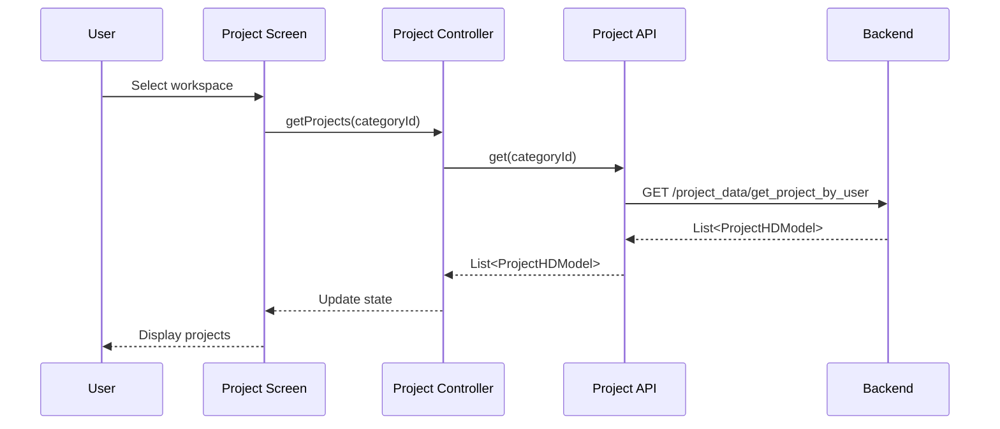
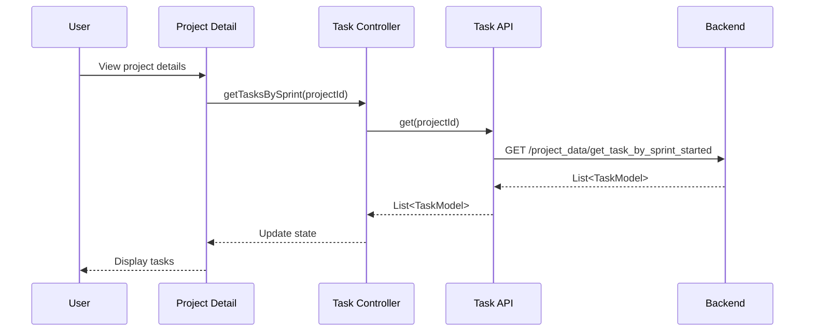

# OHO Task Management System - Data Flow Diagram (With Images)

## ภาพรวมระบบ
OHO Task Management System เป็นแอปพลิเคชั่น Flutter สำหรับจัดการงานและโปรเจค ที่ใช้สถาปัตยกรรม Clean Architecture พร้อม Riverpod เป็น State Management

## Data Flow Layers


## หลัก Data Flow ของระบบ

### 1. Authentication Flow


### 2. Workspace Management Flow


### 3. Project Management Flow


### 4. Task Management Flow


### 5. Profile Management Flow


## Core Data Models

### 1. User & Authentication
- **UserLoginModel**: ข้อมูล login และ access token
- **UserModel**: ข้อมูลผู้ใช้
- **UserRoleModel**: บทบาทของผู้ใช้

### 2. Workspace & Projects
- **WorkspaceModel**: พื้นที่ทำงาน
- **CategoryModel**: หมวดหมู่โปรเจค
- **ProjectHDModel**: ข้อมูลโปรเจค

### 3. Task Management
- **SprintModel**: Sprint สำหรับการจัดการงาน
- **TaskModel**: งาน/Task
- **TaskStatusModel**: สถานะของงาน
- **PriorityModel**: ลำดับความสำคัญ
- **TypeOfWorkModel**: ประเภทของงาน

### 4. Activity & Comments
- **CommentModel**: ความคิดเห็น
- **ActivityTypeModel**: ประเภทกิจกรรม

## API Endpoints Structure

### Master Data APIs
- `/master_data/get_workspace_by_user` - ดึง workspace ของ user
- `/master_data/insert_or_update_workspace` - เพิ่ม/แก้ไข workspace
- `/master_data/delete_workspace_role` - ลบ user จาก workspace

### Project Data APIs
- `/project_data/get_project_by_user` - ดึงโปรเจคของ user
- `/project_data/insert_or_update_project_hd` - เพิ่ม/แก้ไขโปรเจค
- `/project_data/get_sprint_by_project` - ดึง sprint ของโปรเจค
- `/project_data/get_task_by_sprint_started` - ดึง task ใน sprint
- `/project_data/dashboard_*` - APIs สำหรับ dashboard data

### Security APIs
- `/security/login` - เข้าสู่ระบบ
- `/security/update_user_profile` - แก้ไขข้อมูลส่วนตัว
- `/security/change_password` - เปลี่ยนรหัสผ่าน
- `/security/upload_avatar` - อัพโหลดรูปโปรไฟล์

## State Management Pattern

### Riverpod Providers Architecture
```dart
// API Provider
final apiProvider = Provider<APIClass>((ref) => APIClass(ref: ref));

// Controller Provider
final controllerProvider = StateNotifierProvider<Controller, AsyncValue<Data>>(
  (ref) => Controller(ref)
);

// UI Consumer
Consumer(
  builder: (context, ref, child) {
    final state = ref.watch(controllerProvider);
    return state.when(
      data: (data) => DataWidget(data),
      loading: () => LoadingWidget(),
      error: (error, stack) => ErrorWidget(error),
    );
  }
)
```

## Local Storage Services

### LocalStorageService
- **saveToken()**: บันทึก access token
- **getToken()**: ดึง access token
- **saveUserLogin()**: บันทึกข้อมูล user
- **getUserLogin()**: ดึงข้อมูล user

## Navigation Structure

### App Router (GoRouter)
```
/login - หน้าเข้าสู่ระบบ
/home - หน้าหลัก (Workspace selection)
/project - หน้าโปรเจค
  /detail - รายละเอียดโปรเจค
/setting - การตั้งค่า
  /profile - โปรไฟล์
```

## Error Handling Flow

### Dio Interceptor Pattern
1. **Request Interceptor**: เพิ่ม Authorization header
2. **Response Interceptor**: จัดการ response
3. **Error Interceptor**: จัดการ error และ redirect กรณี 401

### State Error Handling
```dart
state.when(
  data: (data) => SuccessWidget(),
  loading: () => LoadingWidget(),
  error: (error, stack) => ErrorWidget(error)
);
```

## Performance Optimizations

### 1. Provider Caching
- ใช้ `Provider` สำหรับ services ที่ไม่เปลี่ยนแปลง
- ใช้ `StateNotifierProvider` สำหรับ state ที่เปลี่ยนแปลง

### 2. Lazy Loading
- โหลดข้อมูลเมื่อจำเป็นเท่านั้น
- ใช้ `FutureProvider.family` สำหรับ parameterized data

### 3. State Invalidation
- ใช้ `ref.invalidate()` เพื่อรีเฟรชข้อมูล
- ใช้ `ref.refresh()` สำหรับ force reload

## Security Considerations

### 1. Token Management
- เก็บ token ใน secure storage
- Auto-refresh token mechanism
- Logout เมื่อ token หมดอายุ

### 2. API Security
- Bearer token authentication
- Error handling สำหรับ unauthorized access
- Secure HTTP communication

---

*Diagram นี้แสดงการไหลของข้อมูลในระบบ OHO Task Management ตั้งแต่ UI layer จนถึง Backend APIs โดยใช้ Clean Architecture pattern ร่วมกับ Riverpod state management รวมถึงการแสดง diagrams เป็นรูปภาพ*
