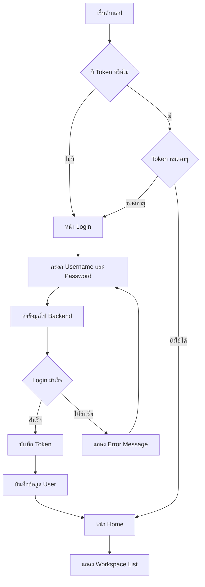
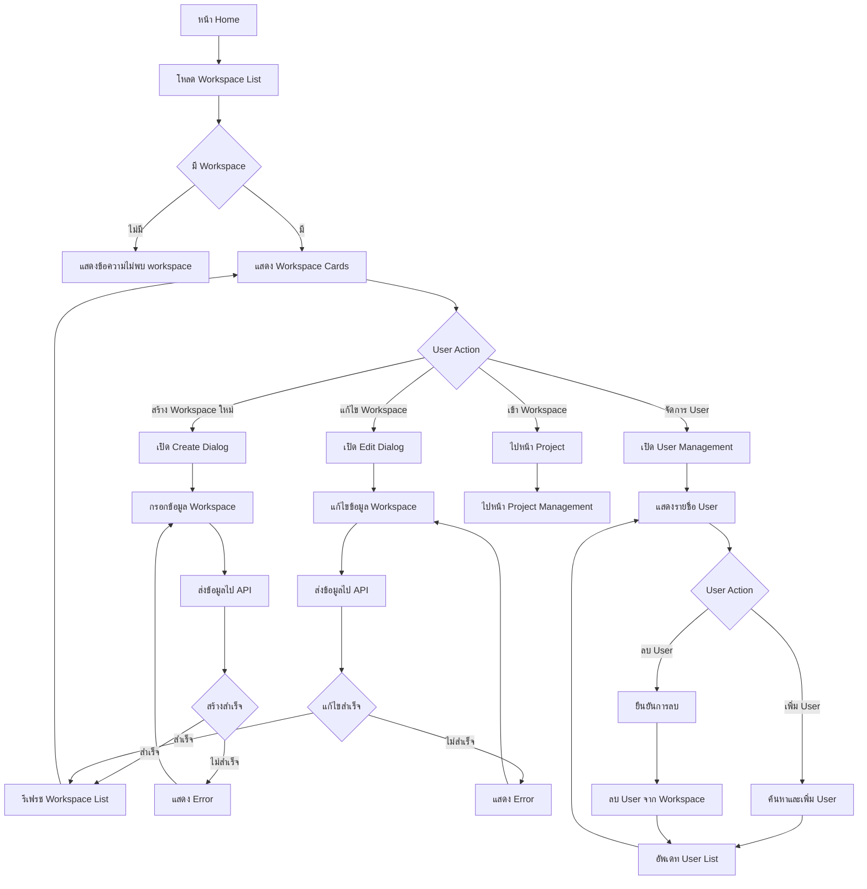
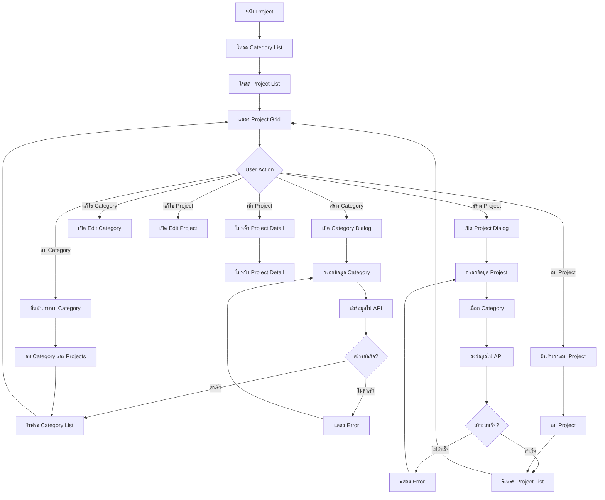
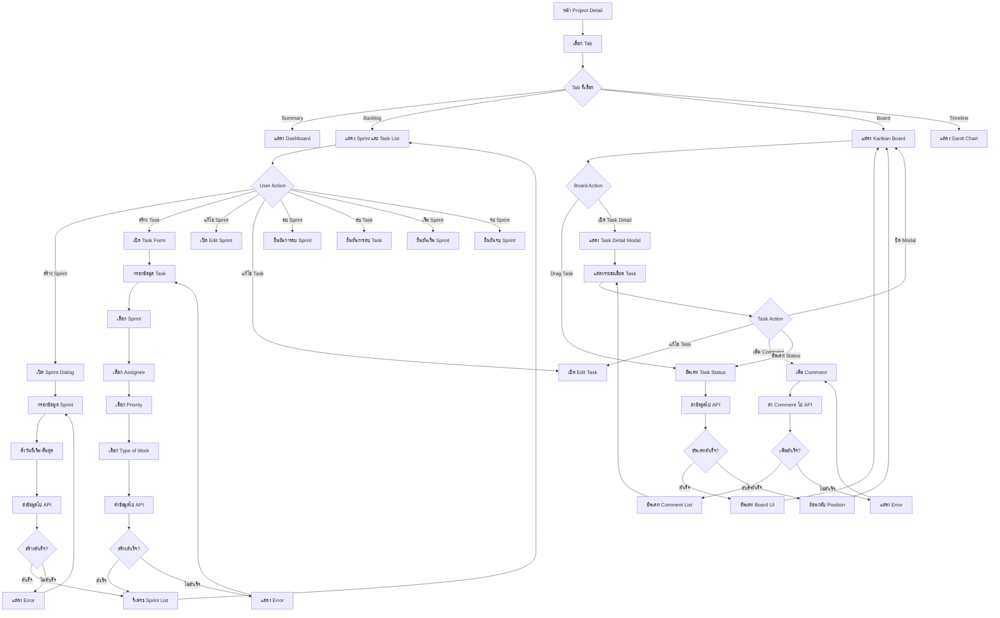
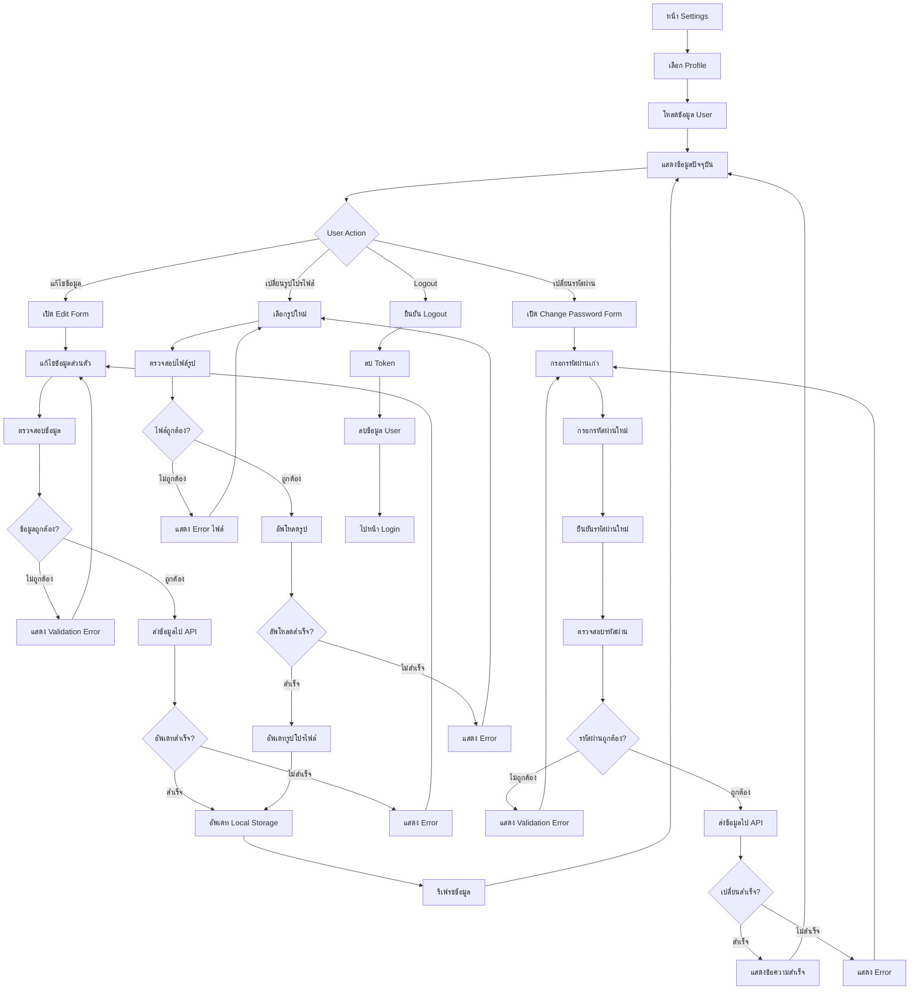
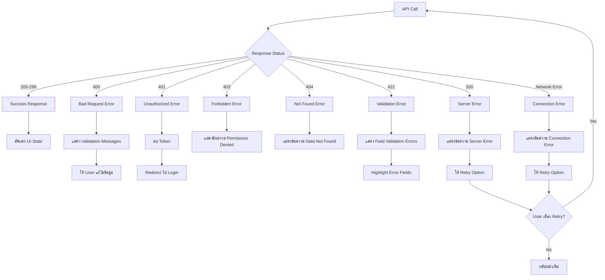
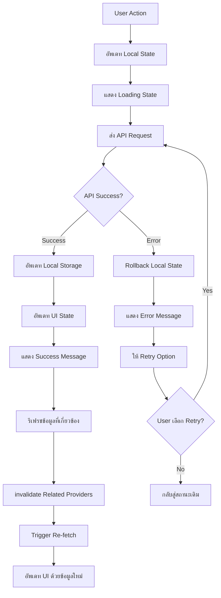
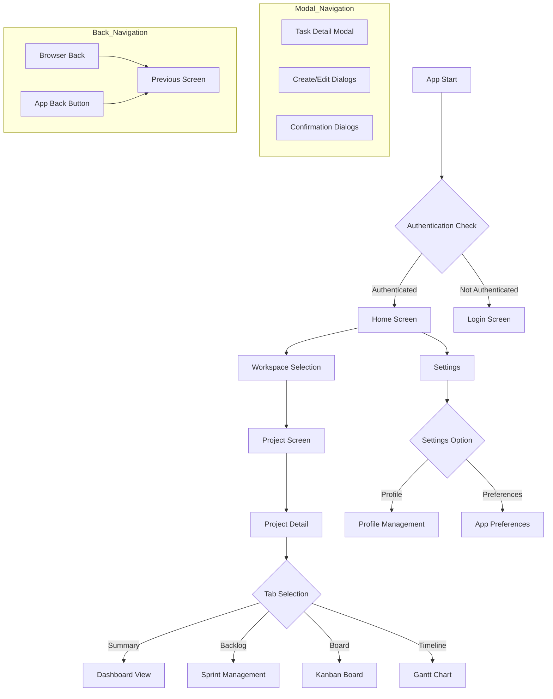

# OHO Task Management System - Flowchart

## ภาพรวมระบบ
Flowchart นี้แสดงการไหลของกระบวนการทำงานหลักใน OHO Task Management System ตั้งแต่การเข้าสู่ระบบจนถึงการจัดการงานต่างๆ

## 1. Authentication Flow (การเข้าสู่ระบบ)

## 2. Workspace Management Flow (การจัดการ Workspace)

## 3. Project Management Flow (การจัดการโปรเจค)

## 4. Task Management Flow (การจัดการงาน)

## 5. Profile Management Flow (การจัดการข้อมูลส่วนตัว)

## 6. Error Handling Flow (การจัดการ Error)

## 7. Data Synchronization Flow (การซิงค์ข้อมูล)

## 8. Navigation Flow (การนำทาง)

---

*Flowchart นี้แสดงการไหลของกระบวนการทำงานทั้งหมดในระบบ OHO Task Management ครอบคลุมตั้งแต่การเข้าสู่ระบบ การจัดการ workspace, project, task จนถึงการจัดการข้อมูลส่วนตัวและการจัดการ error ต่างๆ*
